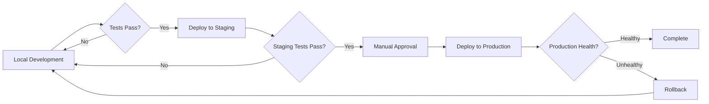

# AI Manager Hierarchy System - Deployment Overview

**Document Type**: Deployment Guide
**Scope**: All Deployment Environments (Development, Staging, Production)
**Related**: `DEPLOYMENT_GUIDE.md` (application-specific deployment)

---

<!-- section_id: "d77d3262-ffc8-4ce6-8a25-24a80d2aecc3" -->
## Purpose

This document provides deployment guidance specific to the **AI Manager Hierarchy System** (Agent OS). It clarifies how the layer/stage architecture maps to deployed services, background workers, and infrastructure components.

<!-- section_id: "952eaa49-a2fb-45a9-b013-9f31eb725969" -->
## Normative Specification

This document is a **derived implementation guide** from the canonical specification:

- **Source**: `/home/dawson/code/0_layer_universal/0_context/-1_research/-1.01_things_researched/ai_manager_hierarchy_system/things_learned/ideal_ai_manager_hierarchy_system/production_deployment.md`
- **Status**: Normative (refer to source for authoritative details)

For application-specific deployment (Flask, Node.js, etc.), see:
- **Application Deployment**: `../DEPLOYMENT_GUIDE.md`

---

<!-- section_id: "5b4f43b6-fb99-42ec-96d7-c3c2eb7d96b2" -->
## Quick Reference

<!-- section_id: "f59e5102-59e5-4aea-9ed7-1edfa06fe43c" -->
### Deployment Patterns by Environment

| Environment | Architecture | Layers | Workers | Cost |
|------------|--------------|--------|---------|------|
| Development | Single-machine | L0-L3 | Local processes | $0-10/day |
| Staging | Distributed (small) | L0-L3 | 2-5 workers | $10-50/day |
| Production | Distributed (scaled) | L0-L4+ | 10-50+ workers | $50-500+/day |

<!-- section_id: "8a3e9220-28ec-4b7a-826d-c6a3a74352dc" -->
### Component Mapping

```
AI Manager Hierarchy → Deployment Services

Layer 0 Manager → Supervisor Service (1-3 replicas)
Layer 1 Managers → Queue + Workers (project-level)
Layer 2 Managers → Queue + Workers (feature-level)
Layer 3 Workers → Worker Pool (component-level)
Handoffs → S3/GCS/Filesystem Storage
Logs → Centralized Logging (ELK/Loki)
Metrics → Prometheus + Grafana
```

---

<!-- section_id: "1473e851-f1c6-44ee-8059-eb7a561566b0" -->
## Deployment Architectures

<!-- section_id: "997693cf-6b15-46ec-9f41-0fc46a0e6ae1" -->
### Pattern 1: Single-Machine Development

**Best For**: Local development, testing, small personal projects

**Architecture**:
```
┌─────────────────────────────────────┐
│  Developer Machine / WSL            │
│  ┌───────────────────────────────┐  │
│  │  Supervisor (Python Process)  │  │
│  └───────────┬───────────────────┘  │
│              │                       │
│  ┌───────────▼───────────────────┐  │
│  │  File-based Task Queue        │  │
│  │  (<workspace>/queues/)        │  │
│  └───────────┬───────────────────┘  │
│              │                       │
│  ┌───────────▼───────────────────┐  │
│  │  Worker Processes (2-4)       │  │
│  │  - codex (subprocess)         │  │
│  │  - gemini (API calls)         │  │
│  │  - claude (API calls)         │  │
│  └───────────────────────────────┘  │
│                                     │
│  Storage: Local Filesystem          │
│  Database: SQLite                   │
│  Logs: Local files                  │
└─────────────────────────────────────┘
```

**Characteristics**:
- Supervisor runs as local Python process
- Workers spawn as subprocesses or API calls
- Handoffs stored in `<workspace>/layer_N/N.01_manager_handoff_documents/`
- Task state in SQLite database
- Logs in `<workspace>/logs/`

**Deployment Steps**:
```bash
# 1. Install dependencies
cd <workspace>
python -m venv .venv
source .venv/bin/activate
pip install -r requirements.txt

# 2. Configure environment
cp .env.example .env
# Edit .env with API keys and budget limits

# 3. Start supervisor
python supervisor/main.py --mode=development

# 4. Monitor logs
tail -f logs/supervisor.log
```

**Pros**:
- Simple setup, easy debugging
- No infrastructure costs
- Fast iteration

**Cons**:
- No horizontal scaling
- Single point of failure
- Limited throughput

---

<!-- section_id: "e86fe449-5f0d-4abf-a8ed-dc026b8850a4" -->
### Pattern 2: Distributed Staging

**Best For**: Testing production deployment patterns, team collaboration

**Architecture**:
```
┌─────────────────────────────────────────────┐
│  Load Balancer (nginx/HAProxy)             │
└─────────────┬───────────────────────────────┘
              │
┌─────────────▼───────────────────────────────┐
│  Supervisor Cluster (2-3 replicas)          │
│  - Leader election (Consul/etcd)            │
│  - Shared state (PostgreSQL)                │
└─────────────┬───────────────────────────────┘
              │
┌─────────────▼───────────────────────────────┐
│  Task Queue (Redis/RabbitMQ)                │
│  - Priority queues per layer                │
│  - Dead letter queue for failures           │
└─────────────┬───────────────────────────────┘
              │
┌─────────────▼───────────────────────────────┐
│  Worker Pool (5-10 workers)                 │
│  - Kubernetes pods / Docker containers      │
│  - Auto-scale on queue depth                │
└─────────────┬───────────────────────────────┘
              │
┌─────────────▼───────────────────────────────┐
│  Shared Storage (S3/GCS)                    │
│  - Handoff documents                        │
│  - Code artifacts                           │
│  - Logs (centralized)                       │
└─────────────────────────────────────────────┘
```

**Characteristics**:
- Multiple supervisor replicas with leader election
- Centralized task queue (Redis/RabbitMQ)
- Worker pool scales based on queue depth
- Handoffs stored in cloud storage (S3/GCS)
- Centralized logging (ELK stack, Loki)
- Metrics collection (Prometheus)

**Deployment Steps**:
```bash
# 1. Deploy infrastructure (Terraform/CloudFormation)
cd infrastructure/staging
terraform init
terraform apply

# 2. Deploy supervisor cluster
kubectl apply -f k8s/supervisor-deployment.yaml

# 3. Deploy worker pool
kubectl apply -f k8s/worker-deployment.yaml

# 4. Configure monitoring
kubectl apply -f k8s/monitoring/

# 5. Verify deployment
kubectl get pods -n ai-manager
curl https://staging.example.com/health
```

**Pros**:
- High availability
- Horizontal scaling
- Mirrors production architecture

**Cons**:
- More complex setup
- Higher costs
- Requires infrastructure expertise

---

<!-- section_id: "efc98cc4-ba67-45d9-90d5-d05ac6459983" -->
### Pattern 3: Production at Scale

**Best For**: Production workloads, high-volume processing, enterprise deployments

**Architecture**: See normative specification Section 1.2 for full distributed production architecture diagram.

**Key Components**:

1. **Supervisor Cluster** (3-5 replicas)
   - Leader election via Consul/etcd
   - Shared state in PostgreSQL
   - Health checks and auto-restart
   - Geographic distribution

2. **Task Queue** (Redis Cluster or RabbitMQ)
   - Priority queues per layer (L0 highest priority)
   - Dead letter queues for failed tasks
   - Message persistence
   - At-least-once delivery guarantees

3. **Worker Pool** (10-100+ workers)
   - Kubernetes HPA or ECS auto-scaling
   - Spot/preemptible instances for cost savings
   - Stateless design (no local state)
   - Graceful shutdown on scale-down

4. **Storage** (S3/GCS/Azure Blob)
   - Handoff documents
   - Code artifacts
   - Logs (hot tier)
   - Metrics (time-series database)

5. **Observability Stack**
   - Metrics: Prometheus + Grafana
   - Logs: ELK Stack (Elasticsearch, Logstash, Kibana) or Loki
   - Traces: Jaeger or Zipkin
   - Alerts: Alertmanager + PagerDuty

**Deployment Steps**: See normative specification Section 5 for complete checklist and blue-green deployment procedure.

---

<!-- section_id: "d0d55055-d79b-478b-9198-b67e7719fd5a" -->
## Layer-to-Service Mapping

<!-- section_id: "cc382818-2dd0-47e7-8f45-7788ebb8f54d" -->
### How Layers Map to Deployed Services

```yaml
Layer 0 (Universal Manager):
  service: supervisor-main
  replicas: 3
  role: Orchestrate all L1 managers
  responsibilities:
    - Discover new user requests
    - Create L0 → L1 handoffs
    - Monitor all downstream tasks
    - Enforce budget limits
    - Generate reports

Layer 1 (Project Manager):
  service: manager-worker-L1
  replicas: 2-5
  role: Project-level planning and coordination
  responsibilities:
    - Read L0 → L1 handoffs
    - Create project plans
    - Spawn L2 feature managers
    - Aggregate feature results

Layer 2 (Feature Manager):
  service: manager-worker-L2
  replicas: 5-20
  role: Feature implementation
  responsibilities:
    - Read L1 → L2 handoffs
    - Implement features
    - Spawn L3 component workers
    - Aggregate component results

Layer 3 (Component Worker):
  service: worker-pool-L3
  replicas: 10-50
  role: Component implementation
  responsibilities:
    - Read L2 → L3 handoffs
    - Implement components
    - Run tests
    - Report results

Layer 4+ (Sub-component Worker):
  service: worker-pool-L4
  replicas: 5-20
  role: Fine-grained implementation
  responsibilities:
    - Implement sub-components
    - Unit-level testing
```

<!-- section_id: "c4270fa8-6c86-4a45-854c-f57e4d0f44f2" -->
### Service Communication

```
Supervisor (L0) → Task Queue → Manager Workers (L1)
                            → Manager Workers (L2)
                            → Component Workers (L3)
                            → Sub-component Workers (L4)

All services read/write:
  - Handoff storage (S3/GCS)
  - Shared database (PostgreSQL)
  - Metrics (Prometheus)
  - Logs (centralized logging)
```

---

<!-- section_id: "5f1c0da3-b4da-4111-b762-0ff80537d185" -->
## Environment-Specific Configuration

<!-- section_id: "6ea2e166-37d4-4351-90c7-d1d75c4c4acc" -->
### Development Environment

**Configuration** (`config/development.yaml`):
```yaml
environment: development

supervisor:
  mode: single_machine
  workers: 4
  poll_interval: 10  # seconds

storage:
  type: filesystem
  handoffs_dir: ./handoffs
  artifacts_dir: ./artifacts

database:
  type: sqlite
  path: ./data/tasks.db

logging:
  level: DEBUG
  output: file
  path: ./logs/supervisor.log

budget:
  daily_limit: 10.00
  enforce: false  # Warnings only
```

**Tools**:
- Local AI tool binaries (codex, claude-code)
- API calls to cloud services (OpenAI, Anthropic, Google)

<!-- section_id: "397ace3c-9e22-4cc1-ab21-f0ef6f17644e" -->
### Staging Environment

**Configuration** (`config/staging.yaml`):
```yaml
environment: staging

supervisor:
  mode: distributed
  replicas: 2
  leader_election:
    backend: consul
    endpoint: consul.staging.internal

storage:
  type: s3
  bucket: ai-manager-staging
  region: us-east-1

database:
  type: postgresql
  host: postgres.staging.internal
  database: ai_manager_staging

queue:
  type: redis
  endpoint: redis.staging.internal

logging:
  level: INFO
  output: elasticsearch
  endpoint: elasticsearch.staging.internal

monitoring:
  prometheus: prometheus.staging.internal
  grafana: grafana.staging.internal

budget:
  daily_limit: 50.00
  enforce: true
  alert_threshold: 0.8
```

<!-- section_id: "4e1f176a-c152-4379-82ec-5a05077f16f7" -->
### Production Environment

**Configuration** (`config/production.yaml`):
```yaml
environment: production

supervisor:
  mode: distributed
  replicas: 5
  leader_election:
    backend: consul
    endpoint: consul.prod.internal
  high_availability: true

storage:
  type: s3
  bucket: ai-manager-production
  region: us-east-1
  encryption: AES256

database:
  type: postgresql
  host: postgres-primary.prod.internal
  read_replicas:
    - postgres-replica-1.prod.internal
    - postgres-replica-2.prod.internal
  database: ai_manager_production
  ssl_mode: require

queue:
  type: rabbitmq
  cluster:
    - rabbitmq-1.prod.internal
    - rabbitmq-2.prod.internal
    - rabbitmq-3.prod.internal
  vhost: /ai-manager

logging:
  level: WARNING
  output: elasticsearch
  endpoint: elasticsearch.prod.internal
  retention_days: 90

monitoring:
  prometheus: prometheus.prod.internal
  grafana: grafana.prod.internal
  alertmanager: alertmanager.prod.internal
  pagerduty_key: ${PAGERDUTY_KEY}

budget:
  daily_limit: 500.00
  enforce: true
  alert_threshold: 0.9
  emergency_stop_threshold: 1.1

security:
  tls_enabled: true
  api_auth_required: true
  audit_all_actions: true
```

---

<!-- section_id: "aa522e7b-e62f-4c43-8382-76052478f2d2" -->
## Scaling Strategy

<!-- section_id: "39c9af30-3f37-44d8-b84f-adf39b5b18a5" -->
### Vertical Scaling (Per-Service)

**Supervisor**:
- Start: 1 replica (dev)
- Staging: 2-3 replicas
- Production: 3-5 replicas
- Scale trigger: Leadership failover, high load

**Workers**:
- Start: 2-4 local processes (dev)
- Staging: 5-10 containers
- Production: 10-100+ containers
- Scale trigger: Queue depth, task backlog

<!-- section_id: "0d7c7efe-80dc-40cf-8ddf-f9e2131ba8f4" -->
### Horizontal Scaling (Auto-Scaling)

**Kubernetes HPA Example**:
```yaml
apiVersion: autoscaling/v2
kind: HorizontalPodAutoscaler
metadata:
  name: worker-pool-L3
spec:
  scaleTargetRef:
    apiVersion: apps/v1
    kind: Deployment
    name: ai-worker-L3
  minReplicas: 10
  maxReplicas: 50
  metrics:
    - type: External
      external:
        metric:
          name: queue_depth_L3
        target:
          type: AverageValue
          averageValue: "10"  # 10 tasks per worker

    - type: Resource
      resource:
        name: cpu
        target:
          type: Utilization
          averageUtilization: 70

  behavior:
    scaleDown:
      stabilizationWindowSeconds: 300  # Wait 5min
      policies:
        - type: Percent
          value: 50
          periodSeconds: 60

    scaleUp:
      stabilizationWindowSeconds: 0  # Immediate
      policies:
        - type: Pods
          value: 4
          periodSeconds: 60
```

<!-- section_id: "8d7a9e3e-0a3d-4ac0-b2fe-8864adfa23c2" -->
### Cost-Based Scaling

- **Peak Hours**: Scale up workers (9am-5pm)
- **Off-Peak**: Scale down to minimum (5pm-9am)
- **Budget Limits**: Throttle or stop when approaching budget
- **Spot Instances**: Use for L3/L4 workers (70-90% cost savings)

---

<!-- section_id: "ccd841a8-e0d7-4800-8b13-20d3a3341a69" -->
## Deployment Pipeline

<!-- section_id: "ec40acf6-32ac-4ae2-ab57-662627681be5" -->
### Development → Staging → Production



<!-- section_id: "8b587629-5fd8-4f64-a334-14dc48e91e43" -->
### Deployment Steps

**1. Pre-Deployment Checklist**:
- [ ] All tests pass (unit, integration, E2E)
- [ ] Security scan completed
- [ ] Load testing completed
- [ ] Rollback plan documented
- [ ] Budget limits configured
- [ ] Monitoring dashboards ready
- [ ] On-call rotation scheduled

**2. Deployment** (Blue-Green):
```bash
# Deploy new version (green)
kubectl apply -f k8s/supervisor-v2.yaml

# Route 10% traffic to new version
kubectl patch service supervisor -p '{"spec":{"selector":{"version":"v2","weight":"10"}}}'

# Monitor for 15 minutes
watch kubectl get pods -l version=v2

# If healthy, route 50% traffic
kubectl patch service supervisor -p '{"spec":{"selector":{"weight":"50"}}}'

# Monitor for 15 minutes

# If healthy, route 100% traffic
kubectl patch service supervisor -p '{"spec":{"selector":{"version":"v2"}}}'

# Retire old version
kubectl delete deployment supervisor-v1
```

**3. Rollback Criteria**:
- Task failure rate > 20%
- API error rate > 10%
- Response time p95 > 60 seconds
- Any critical alert triggered

**4. Post-Deployment**:
- [ ] Verify monitors are green
- [ ] Check logs for errors
- [ ] Validate task execution
- [ ] Monitor cost/usage
- [ ] Document issues
- [ ] Update runbook

---

<!-- section_id: "d1c85055-5f35-4ea4-b24a-30a9c9c436d6" -->
## Reliability and Fault Tolerance

<!-- section_id: "5f21bd7a-5261-419a-847a-b8d6ce68a4e7" -->
### Failure Modes and Mitigations

| Failure | Impact | Mitigation |
|---------|--------|------------|
| Supervisor crash | Tasks orphaned | Multiple replicas + leader election |
| Worker crash | Task fails | Timeouts + retries + dead letter queue |
| Model API down | Can't execute | Fallback models + circuit breakers |
| Network partition | Workers isolated | Local caching + reconciliation |
| Database failure | State loss | Read replicas + backups |
| Queue failure | Tasks lost | Message persistence + replication |

<!-- section_id: "d315daf7-800b-4732-b23a-49da5e538c57" -->
### High Availability Configuration

**Supervisor Cluster**: See normative specification Section 3.2 for leader election implementation.

**Stateless Workers**: All workers MUST be stateless:
- No local state storage
- Download handoffs from S3/GCS
- Upload results to S3/GCS
- Acknowledge queue messages only after success

---

<!-- section_id: "1aa6e24a-81c6-4089-ab38-96583d40d090" -->
## Monitoring and Observability

<!-- section_id: "a243af49-8b68-45a2-bf4d-f69aef04e236" -->
### Key Metrics

**System Health**:
- Supervisor uptime and leader status
- Worker pool size and utilization
- Queue depth per layer
- Task throughput (tasks/hour)

**Performance**:
- Task duration (p50, p95, p99) per layer
- End-to-end latency (L0 → L3)
- API response times

**Cost**:
- Daily spend vs budget
- Cost per task per layer
- Cost per line of code
- Budget burn rate

**Quality**:
- Task success rate per layer
- Test pass rate
- Code quality scores
- Human review approval rate

<!-- section_id: "0523db6c-7775-4074-91f7-bd0e507090ec" -->
### Dashboards

See observability documentation for dashboard specifications:
- **Reference**: `layer_0/0.02_sub_layers/sub_layer_0_13_universal_protocols/observability/`

<!-- section_id: "4fe25b39-9a42-4970-80cf-f592be3ed2ae" -->
### Alerts

**Critical**:
- Supervisor cluster down
- Daily budget exceeded by >10%
- Task failure rate > 50%

**Warning**:
- Queue backlog growing
- Worker utilization low
- Budget at 80%

---

<!-- section_id: "979402c0-2239-404b-8b3f-fd013485d67a" -->
## Cost Optimization

<!-- section_id: "27588a81-962f-406e-a2e8-711122eac36c" -->
### Production Cost Strategies

1. **Spot/Preemptible Instances** for L3/L4 workers (70-90% savings)
2. **Local Model Hosting** for L3/L4 (Llama, Mistral on-premise)
3. **Smart Caching** of model responses
4. **Task Deduplication** (avoid redundant work)
5. **Off-Peak Scaling** (reduce workers during low-demand periods)

<!-- section_id: "fe4dda3a-fe8f-4f34-be0e-275b85ae7c76" -->
### Budget Management

See safety/governance documentation:
- **Reference**: `layer_0/0.02_sub_layers/sub_layer_0_04_universal_rules/safety_governance.md`

---

<!-- section_id: "e0261108-f5e5-43ca-ae82-f03db0f8b34c" -->
## Security Considerations

<!-- section_id: "668a4269-cfbc-4dcb-942e-eb34e09444cf" -->
### Deployment Security

- **Network Isolation**: Workers in private subnets
- **TLS Everywhere**: All service-to-service communication encrypted
- **Secrets Management**: Use HashiCorp Vault or AWS Secrets Manager
- **API Authentication**: JWT tokens for service authentication
- **Audit Logging**: All actions logged to immutable audit trail

<!-- section_id: "a7b1ffbd-27e0-4b19-9bf2-dad681f334e5" -->
### Compliance

See safety/governance documentation for compliance requirements:
- **Reference**: `layer_0/0.02_sub_layers/sub_layer_0_04_universal_rules/safety_governance.md`

---

<!-- section_id: "9a52e757-3ed6-4615-8344-7329945a8496" -->
## References

- **Normative Spec**: `.../-1_research/.../ideal_ai_manager_hierarchy_system/production_deployment.md`
- **Application Deployment**: `../DEPLOYMENT_GUIDE.md` (Flask, Node.js, etc.)
- **Observability**: `../../sub_layer_0_13_universal_protocols/observability/`
- **Safety & Governance**: `../../sub_layer_0_04_universal_rules/safety_governance.md`

---

<!-- section_id: "240cd2ca-6cf9-492e-9dc7-2fe61ee52d2b" -->
## Quick Start Commands

<!-- section_id: "9040728f-b75e-4462-97df-5ace6f800810" -->
### Start Development Environment

```bash
# Single-machine development
cd <workspace>
source .venv/bin/activate
python supervisor/main.py --config config/development.yaml
```

<!-- section_id: "935a3040-d1d5-4792-9af7-ede5a68fdfd7" -->
### Deploy to Staging

```bash
# Deploy full stack to Kubernetes
kubectl apply -f k8s/staging/

# Verify deployment
kubectl get pods -n ai-manager-staging
```

<!-- section_id: "7689b0ac-fba3-4deb-b2c6-145faaa6a587" -->
### Deploy to Production

```bash
# Review deployment plan
terraform plan -var-file=production.tfvars

# Apply infrastructure changes
terraform apply -var-file=production.tfvars

# Deploy application
kubectl apply -f k8s/production/

# Verify health
curl https://api.example.com/health
```

---

**Last Updated**: 2025-12-24
**Version**: 1.0.0
**Status**: Active
