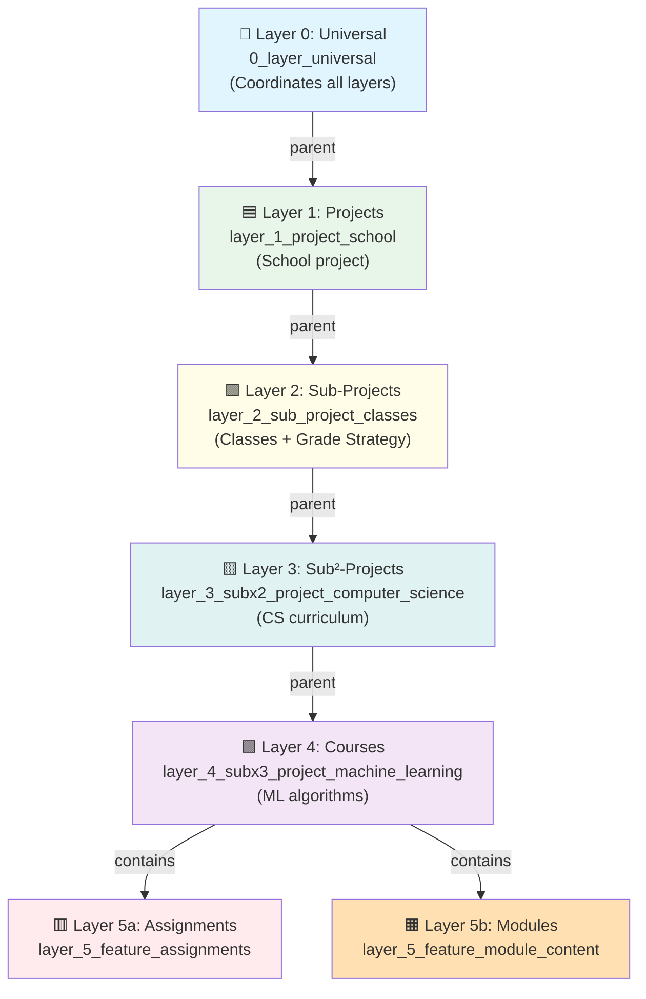
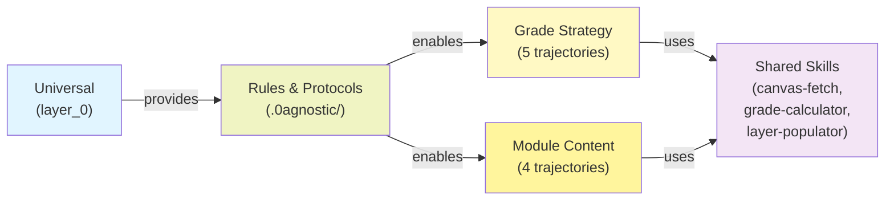
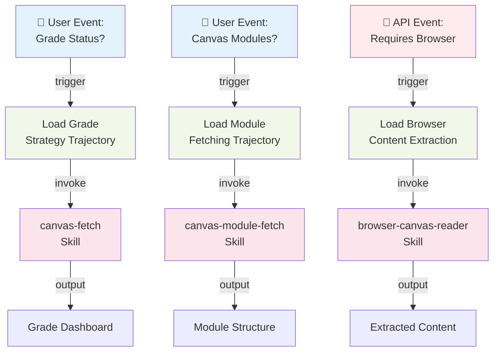

# System Architecture - Hierarchy Visualization

<!-- section_id: "1b7a6b61-700f-4720-8e52-0f07bdd0aa0a" -->
## Layer Hierarchy (Layer 0 → Layer 4)



<!-- section_id: "a2bcabeb-8b1b-4191-b32a-1e227c9387d7" -->
## Resource Inheritance



<!-- section_id: "6e006914-8305-426c-83ab-7619eb36f069" -->
## Trigger System Architecture



<!-- section_id: "cdd33dda-9352-4c63-a55b-303c21e51841" -->
## Path Organization (Current vs. Ideal)

<!-- section_id: "bb6a2ace-a637-4949-baa6-19a9133ef50b" -->
### Current Structure
**Problem**: Deep nesting creates long paths (155+ characters)

```
layer_0_universal/
└── layer_1/layer_1_projects/layer_1_project_school/
    └── layer_2/layer_2_sub_projects/layer_2_sub_project_classes/
        └── layer_3/layer_3_subx2_projects/layer_3_subx2_project_computer_science/
            └── layer_4_group/layer_4_subx3_projects/layer_4_subx3_project_machine_learning/
```

<!-- section_id: "05dd9465-9e50-443e-b10b-84f0fa5343c9" -->
### Ideal Structure (Flattened + Metadata-Based)
**Solution**: Flat filesystem + metadata layer defines relationships

```
school/
├── 0AGNOSTIC.md (defines: "parent: universal, children: classes")
├── .0agnostic/01_knowledge/
├── .0agnostic/02_rules/
└── .0agnostic/03_protocols/

classes/
├── 0AGNOSTIC.md (defines: "parent: school, triggers: grade-strategy")
└── .0agnostic/

computer_science/
├── 0AGNOSTIC.md
└── .0agnostic/

machine_learning/
├── 0AGNOSTIC.md (defines: "parent: cs, inherits: grade-strategy from classes")
└── .0agnostic/
```

**Key insight**: Relationships live in metadata, not filesystem depth.

```

