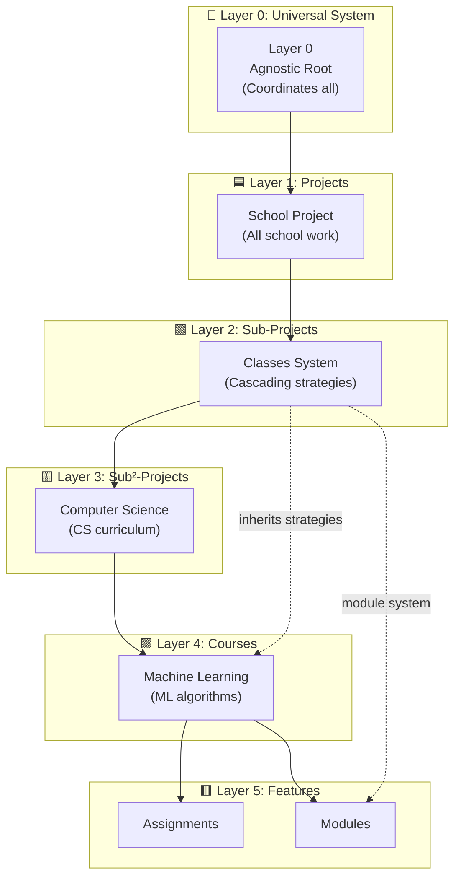
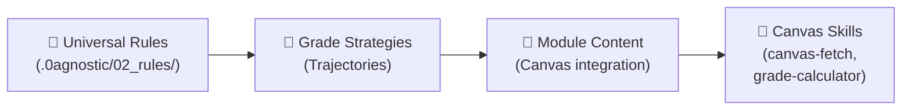
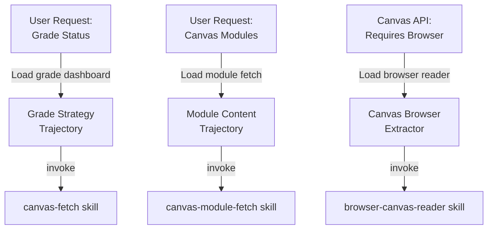

# 0AGNOSTIC System Architecture

## Hierarchy Diagram

```mermaid
graph TD
    subgraph root["🔷 Layer 0: Universal System"]
        L0_universal["Layer 0<br/>Agnostic Root<br/>(Coordinates all)"]
    end

    subgraph layer1["🟦 Layer 1: Projects"]
        L1_school["School Project<br/>(All school work)"]
    end

    subgraph layer2["🟩 Layer 2: Sub-Projects"]
        L2_classes["Classes System<br/>(Cascading strategies)"]
    end

    subgraph layer3["🟨 Layer 3: Sub²-Projects"]
        L3_cs["Computer Science<br/>(CS curriculum)"]
    end

    subgraph layer4["🟪 Layer 4: Courses"]
        L4_ml["Machine Learning<br/>(ML algorithms)"]
    end

    subgraph layer5["🟥 Layer 5: Features"]
        L5_assignments["Assignments"]
        L5_modules["Modules"]
    end

    L0_universal --> L1_school
    L1_school --> L2_classes
    L2_classes --> L3_cs
    L3_cs --> L4_ml
    L4_ml --> L5_assignments
    L4_ml --> L5_modules

    L2_classes -.->|inherits strategies| L4_ml
    L2_classes -.->|module system| L5_modules
```

## Resource Inheritance Chain

```mermaid
graph LR
    R0["🔹 Universal Rules<br/>(.0agnostic/02_rules/)"]
    R1["🔹 Grade Strategies<br/>(Trajectories)"]
    R2["🔹 Module Content<br/>(Canvas integration)"]
    R3["🔹 Canvas Skills<br/>(canvas-fetch,<br/>grade-calculator)"]

    R0 --> R1
    R1 --> R2
    R2 --> R3
```

## Trigger System Overview

```mermaid
graph TD
    T1["User Request:<br/>Grade Status"]
    T2["User Request:<br/>Canvas Modules"]
    T3["Canvas API:<br/>Requires Browser"]

    T1 -->|Load grade dashboard| A1["Grade Strategy<br/>Trajectory"]
    T2 -->|Load module fetch| A2["Module Content<br/>Trajectory"]
    T3 -->|Load browser reader| A3["Canvas Browser<br/>Extractor"]

    A1 -->|invoke| S1["canvas-fetch skill"]
    A2 -->|invoke| S2["canvas-module-fetch skill"]
    A3 -->|invoke| S3["browser-canvas-reader skill"]
```

