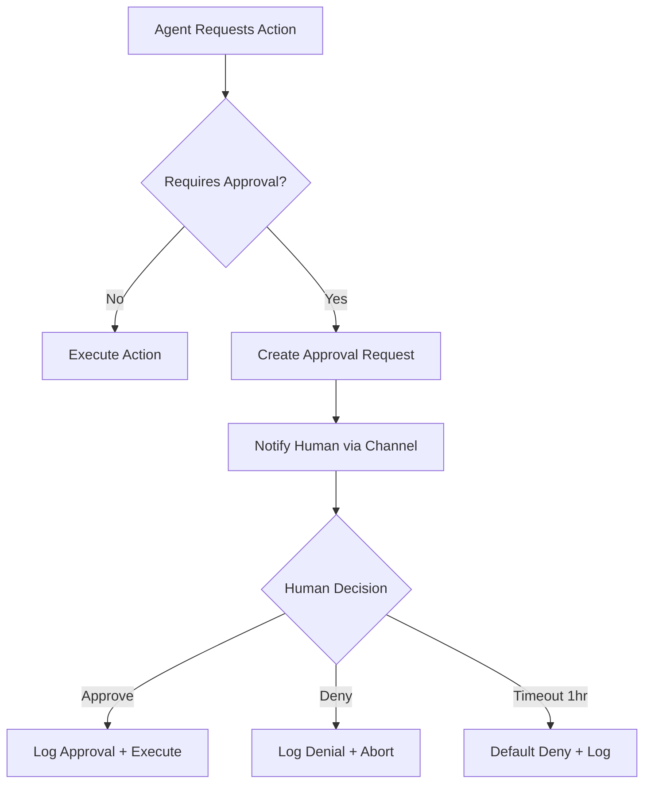

# Safety, Permissions, and Governance Rules

**Rule Type**: Universal
**Scope**: All Layers (L0-L3+)
**Enforcement**: Mandatory
**Related Rules**: Git Commit Rule, Layer Context Header Protocol

---

## Purpose

This document defines security boundaries, permission models, and governance policies for the AI Manager Hierarchy System. It extends existing universal rules with hierarchy-specific guardrails and approval workflows.

## Normative Specification

This document is a **derived implementation guide** from the canonical specification:

- **Source**: `/home/dawson/code/0_ai_context/0_context/-1_research/-1.01_things_researched/ai_manager_hierarchy_system/things_learned/ideal_ai_manager_hierarchy_system/safety_and_governance.md`
- **Status**: Normative (refer to source for authoritative details)

---

## Core Safety Principles

1. **Least Privilege**: Agents operate with minimum permissions needed for their layer
2. **Defense in Depth**: Multiple layers of protection (filesystem, network, commands)
3. **Audit Everything**: All actions are logged for review and compliance
4. **Human Oversight**: Critical decisions require human approval
5. **Fail Secure**: When in doubt, deny and escalate

---

## Permission Levels by Layer

### Layer 0 (Universal) - System Manager

**Permission Level**: 4 (System Manager)

**Allowed**:
- Full filesystem access within workspace
- Execute arbitrary commands (with approval gates)
- Modify all configuration files
- Manage dependencies and infrastructure
- Create/delete directories
- Git operations (commit, push, branch)

**Requires Approval**:
- Delete directory (any)
- Modify security/governance policies
- Change budget limits
- Push to main/master/production branches
- Deploy to production

**Prohibited**:
- Access outside workspace root
- Modify `.git/config` directly
- Bypass approval gates
- Access credentials/secrets

### Layer 1 (Project) - Project Manager

**Permission Level**: 3 (Project Manager)

**Allowed**:
- Create/modify project files
- Manage project dependencies (with approval)
- Modify project configuration files
- Create/delete project directories
- Git operations (commit, push to feature branches)
- API calls (with rate limits)

**Requires Approval**:
- Install new dependencies
- Modify CI/CD configuration
- Change git hooks
- Push to protected branches
- Modify database schemas

**Prohibited**:
- Modify security-critical files (`.env`, credentials)
- Access files outside project scope
- Modify Layer 0 universal rules
- Bypass safety checks

### Layer 2 (Features) - Standard Agent

**Permission Level**: 2 (Standard Agent)

**Allowed**:
- Create/modify feature files
- Run safe commands (linting, testing, building)
- API calls (with rate limits and whitelisting)
- Read project configuration
- Git operations (add, commit to feature branch)

**Requires Approval**:
- Create API endpoints
- Modify database schemas
- Install dependencies
- Create new directories

**Prohibited**:
- Modify project configuration files
- Execute arbitrary shell commands
- Access network without approval
- Modify files outside feature scope

### Layer 3 (Components) - Sandboxed Write

**Permission Level**: 1 (Sandboxed Write)

**Allowed**:
- Create/modify files in designated component directories
- Run safe commands: `npm test`, `npm run lint`, `npm run type-check`
- Read files in component and test directories

**Allowed Directories**:
- `src/components/<component-name>/`
- `tests/<component-name>/`
- `docs/components/<component-name>/`

**Requires Approval**:
- Any file operations outside allowed directories
- Any commands not in whitelist
- Network access

**Prohibited**:
- Modify files outside component scope
- Execute arbitrary commands
- Network access
- Modify configuration files
- Git push operations (delegates to L2/L1)

### Layer 4+ (Sub-components) - Sandboxed Write

**Permission Level**: 1 (Sandboxed Write)

**Allowed**:
- Create/modify files in specific sub-component directory
- Run component-specific tests

**Allowed Directories**:
- `src/components/<component>/<subcomponent>/`

**Requires Approval**:
- Same as Layer 3

**Prohibited**:
- Same as Layer 3

---

## Security Boundaries

### Filesystem Isolation

**Workspace Boundary**:
- All agents MUST operate within the workspace root
- Paths MUST be validated to prevent directory traversal
- Symlinks outside workspace are PROHIBITED

**Layer-Specific Boundaries**:
```yaml
Layer 0:
  allowed:
    - <workspace>/**
  prohibited:
    - <workspace>/.git/config
    - <workspace>/**/*.pem
    - <workspace>/**/*.key
    - <workspace>/.env
    - <workspace>/**/credentials/**

Layer 1:
  allowed:
    - <workspace>/layer_1_project/<project-id>/**
    - <workspace>/layer_0_universal/** (read-only)
  prohibited:
    - <workspace>/layer_0_universal/** (write)
    - <workspace>/.env

Layer 2:
  allowed:
    - <workspace>/layer_2_features/<feature-id>/**
    - <workspace>/layer_1_project/<project-id>/** (read-only)
  prohibited:
    - <workspace>/layer_1_project/** (write)
    - Project configuration files

Layer 3:
  allowed:
    - <workspace>/layer_3_components/<component-id>/**
    - <workspace>/tests/<component-id>/**
  prohibited:
    - Any files outside component directories
```

### Command Execution Sandboxing

**Safe Commands by Permission Level**:

**Level 1 (L3/L4 Workers)**:
```yaml
allowed:
  - npm test
  - npm run lint
  - npm run type-check
  - pytest
  - eslint
  - tsc --noEmit
  - git status
  - git diff
```

**Level 2 (L2 Managers)**:
```yaml
allowed:
  # Includes Level 1 commands, plus:
  - npm install
  - npm run build
  - git add
  - git commit
  - cargo build
  - mvn test
```

**Level 3 (L1 Managers)**:
```yaml
allowed:
  # Includes Level 2 commands, plus:
  - npm run deploy:staging
  - docker build
  - git push (feature branches)
  - gh pr create
```

**Level 4 (L0 Managers)**:
```yaml
allowed:
  # All commands except dangerous patterns:
prohibited:
  - rm -rf /
  - sudo rm
  - chmod 777
  - curl | sh
  - wget | sh
  - dd if=* of=/dev/sd*
```

### Network Access Control

**Whitelist by Layer**:

**Layer 0-2**: API calls allowed to whitelisted domains
```yaml
whitelist:
  - github.com
  - api.github.com
  - registry.npmjs.org
  - pypi.org
  - "*.googleapis.com"
  - api.anthropic.com
  - api.openai.com
```

**Layer 3-4**: Network access PROHIBITED (must delegate to L2/L1)

**Blacklist (All Layers)**:
```yaml
blacklist:
  - localhost
  - 127.0.0.1
  - 10.*.*.*
  - 172.16.0.0/12
  - 192.168.*.*
  - "*.local"
```

---

## Human-in-the-Loop Approval Gates

### Actions Requiring Approval

**Critical Operations**:
```yaml
always_require_approval:
  - delete_directory
  - modify_security_policy
  - change_budget_limits
  - git_push_main_master_production
  - deploy_production
  - install_dependency_unknown
  - modify_database_schema
  - create_api_endpoint_public
```

**Conditional Approval**:
```yaml
require_approval_if:
  delete_file:
    condition: path.depth < 3  # Top-level files
  install_dependency:
    condition: package not in KNOWN_SAFE_PACKAGES
  api_call:
    condition: "'payment' in url or 'user-data' in url"
  budget_increase:
    condition: amount > 100.00
```

### Approval Workflow



**Approval Channels**:
1. Slack/Discord notification
2. Email notification
3. GitHub issue comment (for PR-based workflows)
4. CLI prompt (for interactive sessions)

**Approval Record**:
```json
{
  "approval_id": "approval-20251224-103045",
  "action": "install_dependency",
  "context": {
    "layer": 1,
    "package": "unknown-package@1.0.0",
    "requested_by": "agent-gemini-20251224"
  },
  "requested_at": "2025-12-24T10:30:45Z",
  "approver": "dawson",
  "decision": "approved",
  "approved_at": "2025-12-24T10:35:12Z",
  "reason": "Verified package is safe"
}
```

---

## Budget Governance

### Budget Limits

**Daily Limits**:
```yaml
total_daily_budget: 50.00  # USD

layer_limits:
  L0: 10.00  # Universal management
  L1: 15.00  # Project management
  L2: 15.00  # Feature implementation
  L3: 10.00  # Component implementation

task_limits:
  L0: 5.00   # Per L0 task
  L1: 3.00   # Per L1 task
  L2: 1.00   # Per L2 task
  L3: 0.25   # Per L3 task
```

**Enforcement**:
1. **Pre-execution check**: Estimate cost before spawning worker
2. **Budget reservation**: Reserve budget before execution
3. **Actual tracking**: Track actual cost after completion
4. **Refund on failure**: Return reserved budget if task fails
5. **Approval on exceed**: Require approval to exceed limits

### Budget Tracking

Every task MUST log estimated and actual costs:

```json
{
  "event": "budget.check",
  "layer": 2,
  "stage": "implementation",
  "estimated_cost": 0.50,
  "remaining_budget": {
    "daily": 45.50,
    "layer_daily": 12.00,
    "task_limit": 0.50
  },
  "approved": true,
  "reason": "Within all limits"
}
```

### Budget Alerts

**Warning Thresholds**:
- 80% of daily budget → Warning notification
- 90% of daily budget → Alert + throttle non-critical tasks
- 100% of daily budget → Emergency stop all new tasks

**Budget Increase Approval**:
- Requires human approval
- Must justify need and amount
- Temporary increase (reset next day) or permanent policy change

---

## Resource Quotas

### Per-Agent Quotas

```yaml
default_quotas:
  max_parallel_tasks: 4
  max_task_duration_seconds: 600  # 10 minutes
  max_memory_mb: 4096
  max_file_size_mb: 10
  max_api_calls_per_minute: 60

layer_quotas:
  L0_L2:  # Managers get higher limits
    max_parallel_tasks: 10
    max_task_duration_seconds: 1800  # 30 minutes

  L3_L4:  # Workers get tighter limits
    max_parallel_tasks: 2
    max_task_duration_seconds: 300  # 5 minutes
```

### Quota Enforcement

- **Parallel Tasks**: Block spawning new workers if quota exceeded
- **Task Duration**: Kill tasks that exceed timeout
- **Memory**: Use ulimit or container limits
- **File Size**: Validate before write operations
- **API Calls**: Rate limit with token bucket algorithm

---

## Integration with Existing Rules

### Git Commit Rule

**Extension for Hierarchy**:

1. **Layer 0-1 Managers**: MUST `git commit` and `git push` after every stage
2. **Layer 2 Managers**: MUST `git commit` after feature implementation, `git push` requires approval
3. **Layer 3-4 Workers**: CANNOT `git push` directly, delegate to manager

**Commit Message Format**:
```
[L<layer>][<stage>] <summary>

- Action taken
- Files modified
- Quality metrics

Handoff: <handoff-id>
Cost: $<cost>
```

**Reference**: `layer_0_universal/0.02_sub_layers/sub_layer_0.04_universal_rules/trickle_down_0_universal/0_instruction_docs/git_commit_rule.md`

### Layer Context Header Protocol

**Extension for Governance**:

Every file MUST include permission metadata in header:

```markdown
---
layer: 3
component: LoginForm
owner: agent-codex-20251224
created_at: 2025-12-24T10:30:45Z
permissions:
  read: all
  write: [L3-component-workers, L2-feature-managers]
  delete: [L1-project-managers]
---
```

**Reference**: `layer_0_universal/0.02_sub_layers/sub_layer_0.04_universal_rules/LAYER_CONTEXT_HEADER_PROTOCOL.md`

---

## Audit and Compliance

### Audit Trail Requirements

All actions MUST be logged with:

1. **Timestamp**: ISO 8601 with millisecond precision
2. **Agent Identity**: Layer, stage, tool, model
3. **Action Type**: read/write/execute/delegate/escalate
4. **Resource**: File path, API endpoint, command
5. **Outcome**: success/failure with error details
6. **Approver**: If human approval was required
7. **Cost**: Estimated and actual cost

**Audit Log Location**:
```
<workspace>/logs/audit/
  ├── L0_universal_audit.jsonl
  ├── L1_project_audit.jsonl
  ├── L2_features_audit.jsonl
  └── L3_components_audit.jsonl
```

### Compliance Standards

**Internal Policies**:
- Code Review: All L0-L1 changes require human review
- Security Review: Security-critical changes require specialist review
- Deployment: Production deploys require approval
- Data Handling: No secrets in code, API keys redacted from logs

**Regulatory** (if applicable):
- GDPR: No model training on user data, explicit consent required
- SOC2: Role-based permissions, audit all actions
- HIPAA: No PHI in logs, encrypted storage

---

## Escalation Patterns

### When to Escalate

**Automatic Escalation**:
1. **Permission Denied**: Worker lacks permissions for required action
2. **Budget Exceeded**: Task would exceed budget limits
3. **Quality Gate Failed**: Code quality below threshold
4. **Timeout**: Task exceeds maximum duration
5. **Error Rate**: High error rate indicates systemic issue

**Escalation Flow**:
```
L3 Worker (failed) → L2 Manager (retry/replan)
                  → L1 Manager (if L2 can't resolve)
                  → L0 Manager (if L1 can't resolve)
                  → Human (if L0 can't resolve)
```

### Escalation Record

```json
{
  "event": "task.escalated",
  "from": {
    "layer": 3,
    "agent": "worker-codex-20251224"
  },
  "to": {
    "layer": 2,
    "manager": "manager-claude-20251224"
  },
  "reason": "permission_denied",
  "details": "Cannot modify file outside component directory",
  "original_task": "task-L3-login-impl",
  "retry_count": 1
}
```

---

## Safety Checklist

Before executing any high-risk operation:

- [ ] Verify agent has required permission level
- [ ] Check action is within layer boundaries
- [ ] Validate file paths are within allowed directories
- [ ] Ensure command is in whitelist for permission level
- [ ] Confirm budget is available
- [ ] Check if human approval is required
- [ ] Log all details for audit trail
- [ ] Verify rate limits not exceeded
- [ ] Ensure no secrets will be exposed
- [ ] Validate input data (prevent injection attacks)

---

## Emergency Procedures

### Emergency Stop

**Trigger**: Budget exceeded by >50%, security breach detected, critical system failure

**Procedure**:
1. Stop all new task scheduling
2. Drain active task queues
3. Notify on-call team immediately
4. Lock all write operations
5. Preserve audit logs
6. Wait for human investigation before resuming

**Command** (for L0 managers/humans):
```bash
# Emergency stop all AI operations
export EMERGENCY_STOP=true
# Kill all running workers gracefully
# Preserve all logs and state
```

### Incident Response

**Severity Levels**:
- **P0 (Critical)**: Security breach, data corruption, budget exceeded >50%
- **P1 (High)**: Permission violations, high error rates, budget exceeded >20%
- **P2 (Medium)**: Quality gate failures, moderate errors
- **P3 (Low)**: Individual task failures, warnings

**Response Times**:
- P0: Immediate (page on-call)
- P1: Within 1 hour
- P2: Within 4 hours
- P3: Next business day

---

## References

- **Normative Spec**: `.../-1_research/.../ideal_ai_manager_hierarchy_system/safety_and_governance.md`
- **Observability**: `layer_0_universal/0.02_sub_layers/sub_layer_0.13_universal_protocols/observability/`
- **Git Commit Rule**: `layer_0_universal/0.02_sub_layers/sub_layer_0.04_universal_rules/trickle_down_0_universal/0_instruction_docs/git_commit_rule.md`
- **Layer Context Header**: `layer_0_universal/0.02_sub_layers/sub_layer_0.04_universal_rules/LAYER_CONTEXT_HEADER_PROTOCOL.md`

---

**Last Updated**: 2025-12-24
**Version**: 1.0.0
**Status**: Active
**Enforcement**: Mandatory
