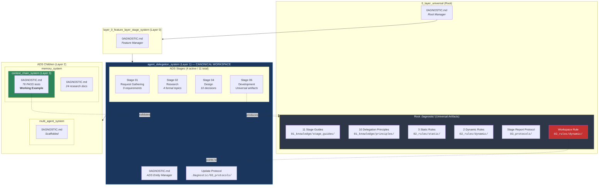
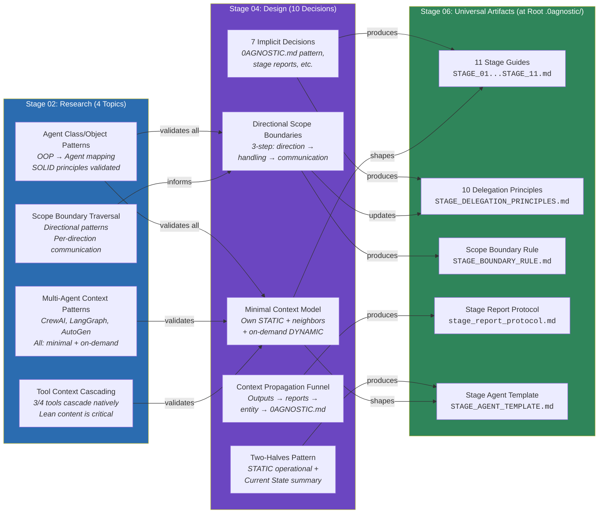
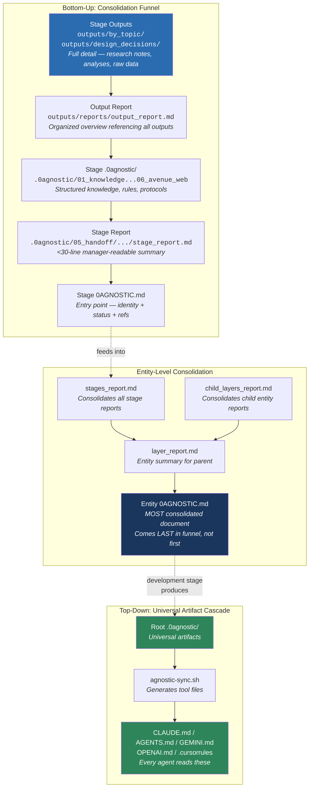
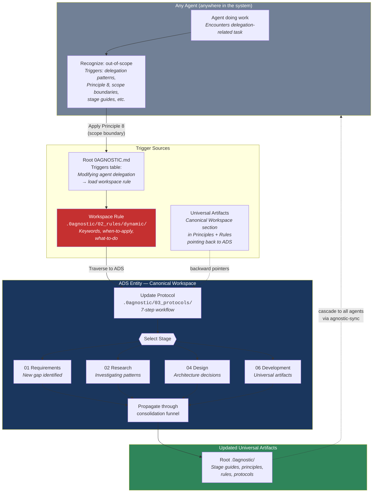
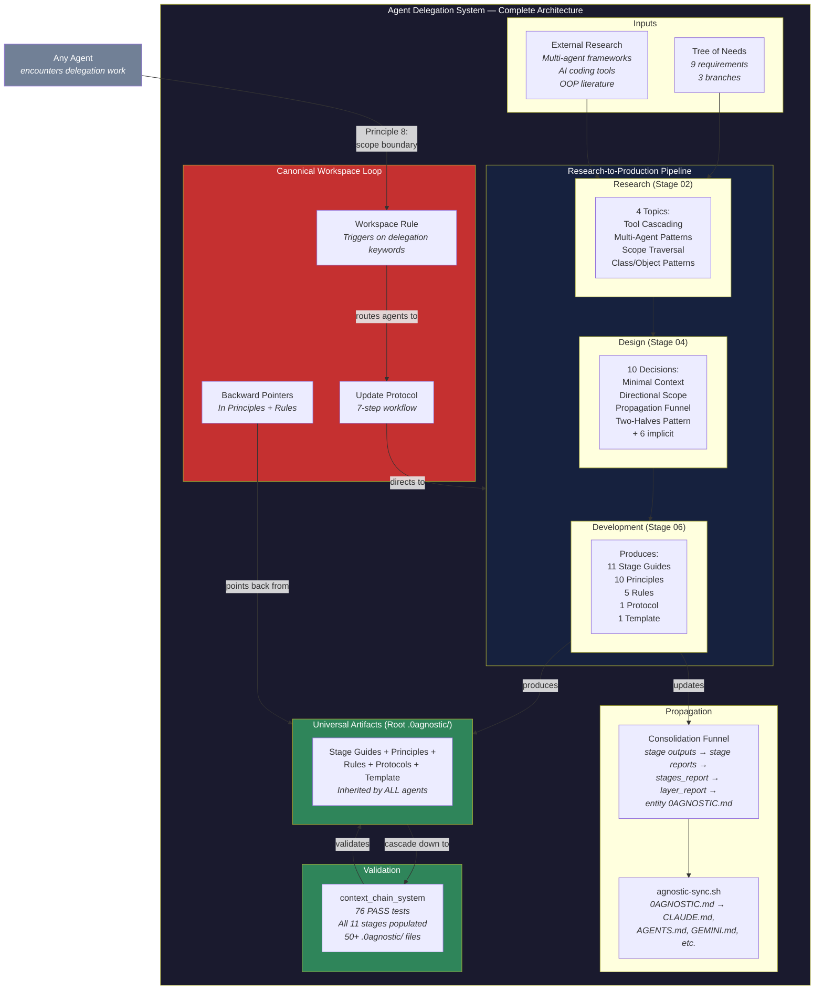
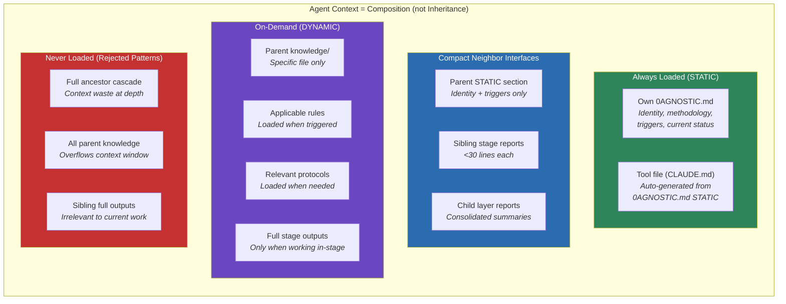

# Agent Delegation System — Architecture Diagrams

Comprehensive Mermaid.js diagrams showing how all components of the agent delegation system connect and fit within the greater layer-stage system.

---

## 1. Entity Hierarchy & Position in the Greater System

Where ADS sits in the layer-stage hierarchy, its children, and the universal artifacts it produces.

---

## 2. Research-to-Production Pipeline

How research findings flow through design decisions into universal artifacts.

---

## 3. Consolidation Funnel

How information propagates from stage outputs up to the entity source of truth, and how universal artifacts cascade down to all agents.

---

## 4. Canonical Workspace Pattern

How agents anywhere in the system recognize delegation work and traverse to ADS.

---

## 5. OOP-to-Agent Architecture Mapping

How object-oriented programming concepts map to the agent delegation architecture.

```mermaid
graph TB
    subgraph OOP["OOP Concepts"]
        direction TB
        BC["Base Class<br/><i>Shared behavior</i>"]
        ABC["Abstract Class<br/><i>Template with required methods</i>"]
        CC["Concrete Class<br/><i>Specific implementation</i>"]
        IF["Interface<br/><i>Public contract</i>"]
        PRIV["Private Methods<br/><i>Hidden implementation</i>"]
        HELPER["Helper / Utility<br/><i>Reusable across classes</i>"]
        COMP["Composition<br/><i>Build from parts</i>"]
        SRP["Single Responsibility<br/><i>One job per class</i>"]
        FACTORY["Factory Pattern<br/><i>Create instances</i>"]
        DI["Dependency Injection<br/><i>Provide dependencies externally</i>"]
    end

    subgraph AGENT["Agent Architecture"]
        direction TB
        UNIV["Universal Infrastructure<br/><code>Root .0agnostic/</code><br/><i>Loaded by all agents</i>"]
        TEMPLATE["Stage Agent Template<br/><code>STAGE_AGENT_TEMPLATE.md</code><br/><i>Required sections</i>"]
        STAGE_AG["Stage 0AGNOSTIC.md<br/><i>Specific methodology</i>"]
        STATIC["0AGNOSTIC.md STATIC<br/><i>Identity, Triggers, I/O</i>"]
        DYNAMIC["DYNAMIC + Stage Outputs<br/><i>On-demand only</i>"]
        RULES_PROTO["Rules + Protocols<br/><code>.0agnostic/02_rules, 03_protocols</code><br/><i>Used by many agents</i>"]
        ON_DEMAND["On-Demand Loading<br/><i>Compose from sources</i>"]
        STAGE_FOCUS["Stage Agents<br/><i>Research / Design / Dev</i>"]
        P8_INST["Principle 8 Instantiation<br/><i>Spawn agent for scope</i>"]
        MANAGER_DEL["Manager Delegation<br/><i>Task + pointer, agent discovers</i>"]
    end

    BC -->|maps to| UNIV
    ABC -->|maps to| TEMPLATE
    CC -->|maps to| STAGE_AG
    IF -->|maps to| STATIC
    PRIV -->|maps to| DYNAMIC
    HELPER -->|maps to| RULES_PROTO
    COMP -->|maps to| ON_DEMAND
    SRP -->|maps to| STAGE_FOCUS
    FACTORY -->|maps to| P8_INST
    DI -->|maps to| MANAGER_DEL

    style OOP fill:#6b46c1,color:#fff
    style AGENT fill:#2b6cb0,color:#fff
```

---

## 6. Complete System Overview

The full picture: how research, design, artifacts, validation, and the canonical workspace loop all connect.

---

## 7. Three-Tier Knowledge Model

How knowledge is structured at each tier, from pointers to full detail.

```mermaid
graph LR
    subgraph T1["Tier 1: Pointers (0AGNOSTIC.md)"]
        direction TB
        T1_WHAT["What this IS<br/><i>Identity, scope, role</i>"]
        T1_WHERE["Where things ARE<br/><i>Navigation, references</i>"]
        T1_STATUS["Current STATUS<br/><i>2-3 sentence summary</i>"]
        T1_LOAD["Always loaded<br/><i>First file agent reads</i>"]
    end

    subgraph T2["Tier 2: Distilled (.0agnostic/)"]
        direction TB
        T2_KNOW["01_knowledge/<br/><i>Domain docs, principles</i>"]
        T2_RULES["02_rules/<br/><i>Static + dynamic rules</i>"]
        T2_PROTO["03_protocols/<br/><i>Workflow procedures</i>"]
        T2_HAND["05_handoff_documents/<br/><i>Reports, instructions</i>"]
        T2_LOAD["On-demand<br/><i>Read specific file needed</i>"]
    end

    subgraph T3["Tier 3: Full (Stage Outputs)"]
        direction TB
        T3_RESEARCH["Research notes<br/><i>by_topic/ directories</i>"]
        T3_DESIGN["Design specs<br/><i>design_decisions/ docs</i>"]
        T3_CODE["Implementations<br/><i>Scripts, tests, artifacts</i>"]
        T3_LOAD["Rarely loaded<br/><i>Only when working in-stage</i>"]
    end

    T1 -->|"points to"| T2
    T2 -->|"summarizes"| T3

    MANAGER["Entity Manager<br/><i>Works at Tier 1</i>"]
    STAGE_AG2["Stage Agent<br/><i>Loads Tier 2 on demand</i>"]
    WORKER["In-Stage Worker<br/><i>Reads Tier 3 detail</i>"]

    MANAGER -.-> T1
    STAGE_AG2 -.-> T2
    WORKER -.-> T3

    style T1 fill:#2f855a,color:#fff
    style T2 fill:#2b6cb0,color:#fff
    style T3 fill:#6b46c1,color:#fff
```

---

## 8. Agent Context Model (What Each Agent Knows)

---

## Diagram Index

| # | Diagram | Shows |
|---|---------|-------|
| 1 | Entity Hierarchy | Where ADS sits, its children, and universal artifact production |
| 2 | Research-to-Production Pipeline | How 4 research topics → 10 design decisions → universal artifacts |
| 3 | Consolidation Funnel | Bottom-up propagation from stage outputs to entity source of truth |
| 4 | Canonical Workspace Pattern | How agents recognize delegation work and traverse to ADS |
| 5 | OOP-to-Agent Mapping | How class/object patterns map to agent architecture concepts |
| 6 | Complete System Overview | Full picture of all components and their connections |
| 7 | Three-Tier Knowledge | Pointer → Distilled → Full knowledge tiers |
| 8 | Agent Context Model | What each agent loads: always, compact, on-demand, never |
