# Dependency-Based Agent Architecture Diagrams

Visualizations of the dependency-based agent hierarchy design for LangTrak.

**Companion to**: `../dependency_based_agent_hierarchy_design.md`, `../oop_class_hierarchy.md`
**Date**: 2026-02-26

---

## 1. Inter-Layer Dependency Chain

The 7-layer linear dependency chain. Each layer depends on all layers below it.

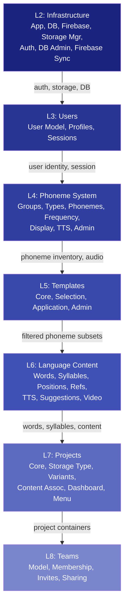

---

## 2. L2 Infrastructure Internal Dependencies (DAG)

The most complex layer — a directed acyclic graph with diamond convergence patterns.

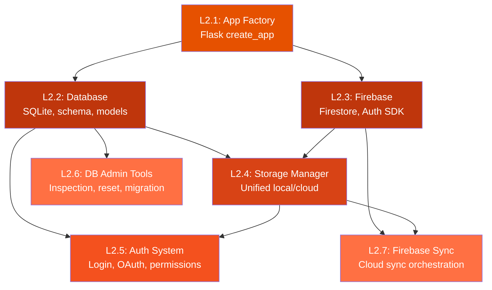

---

## 3. L4 Phoneme System Internal Dependencies (Sequence + Branches)

A sequence core with independent feature branches trailing from the main chain.

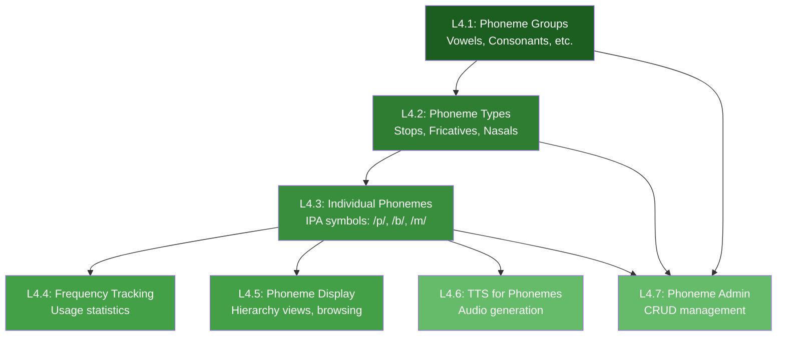

---

## 4. L6 Language Content Internal Dependencies (Containment Sequence + Branches)

A containment chain (words contain syllables contain positions) with enhancement branches.

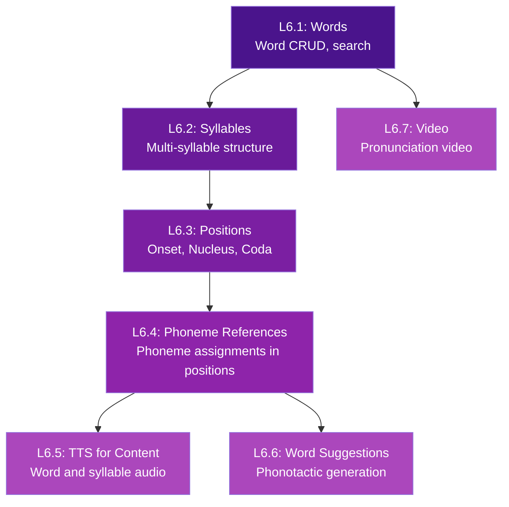

---

## 5. L7 Projects Internal Dependencies (Star/Hub)

A hub pattern — everything depends on the core, nothing depends on each other.

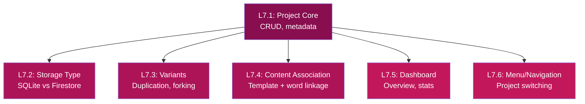

---

## 6. OOP Inheritance Hierarchy

The three-level class hierarchy with abstract bases and concrete implementations.

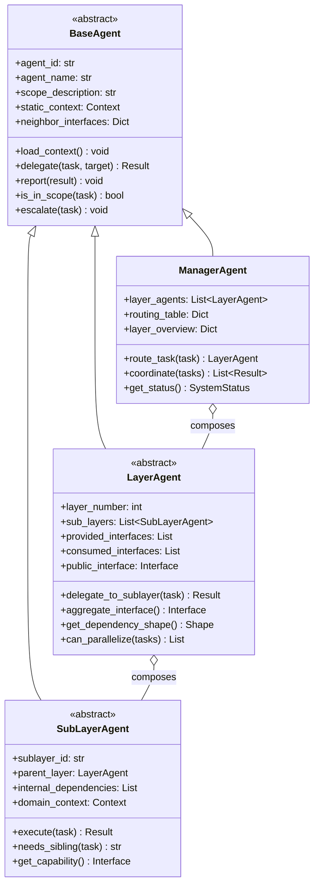

---

## 7. Concrete Layer Agents

The 7 concrete LayerAgent implementations with their interface relationships.

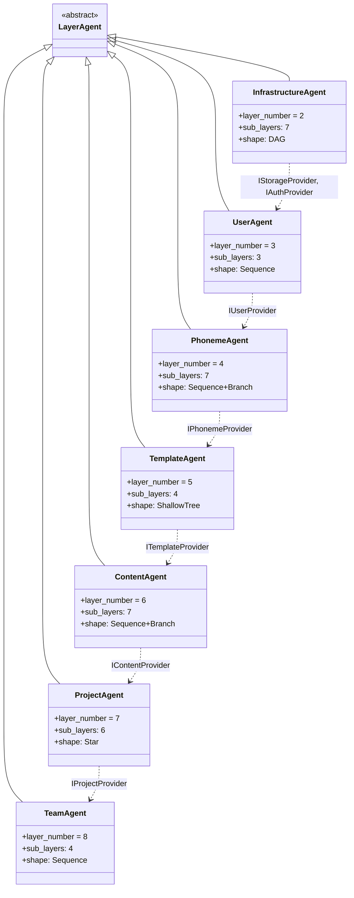

---

## 8. Interface Segregation Map

Which interfaces each layer provides and which it consumes.

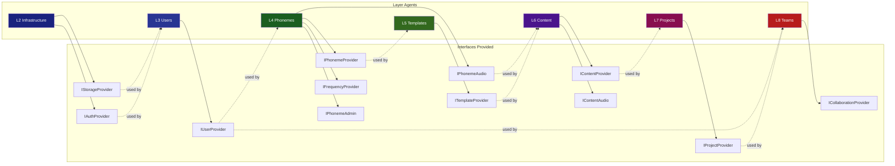

---

## 9. Delegation Flow — Task T5: Team Invitation

Sequence diagram showing how a multi-layer task flows through the class hierarchy.

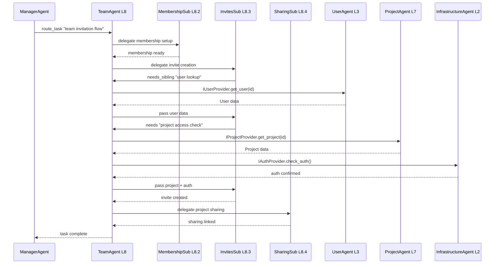

---

## 10. Cross-Cutting Feature Absorption

Shows where L9, L10, L11 features were absorbed into domain layers.

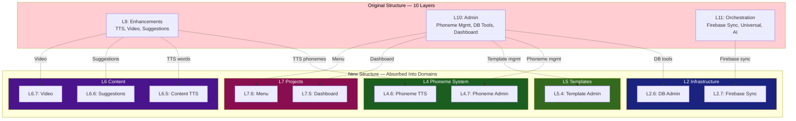

---

## 11. Full Composition Tree

The complete has-a object graph at runtime — Manager contains Layers, Layers contain Sub-layers.

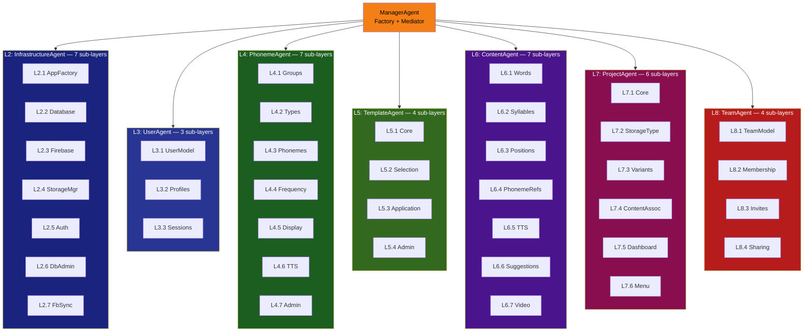

---

## Diagram Index

| # | Diagram | Shows |
|---|---------|-------|
| 1 | Inter-Layer Dependency Chain | 7-layer linear chain L2→L8 with interface labels |
| 2 | L2 Infrastructure Internal | DAG with diamond convergence at Storage Manager and Auth |
| 3 | L4 Phoneme System Internal | Sequence core with TTS, Display, Frequency branches |
| 4 | L6 Language Content Internal | Containment chain with TTS, Suggestions, Video branches |
| 5 | L7 Projects Internal | Star/hub pattern — everything depends on Core |
| 6 | OOP Inheritance Hierarchy | BaseAgent → LayerAgent/ManagerAgent/SubLayerAgent class diagram |
| 7 | Concrete Layer Agents | 7 LayerAgent subclasses with interface dependencies |
| 8 | Interface Segregation Map | 12 interfaces: who provides, who consumes |
| 9 | Delegation Flow T5 | Sequence diagram of multi-layer team invitation task |
| 10 | Cross-Cutting Absorption | Where L9/L10/L11 features moved into domain layers |
| 11 | Full Composition Tree | Complete has-a graph: Manager → Layers → 38 Sub-layers |
