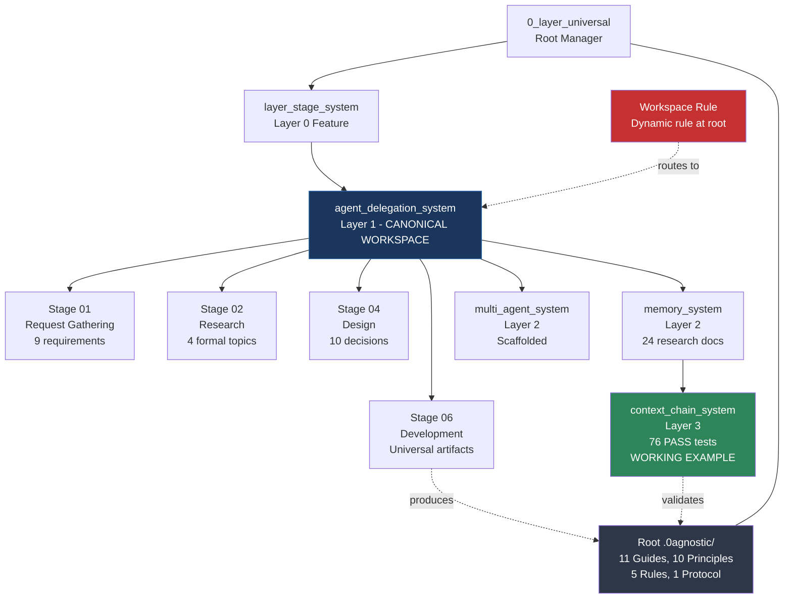
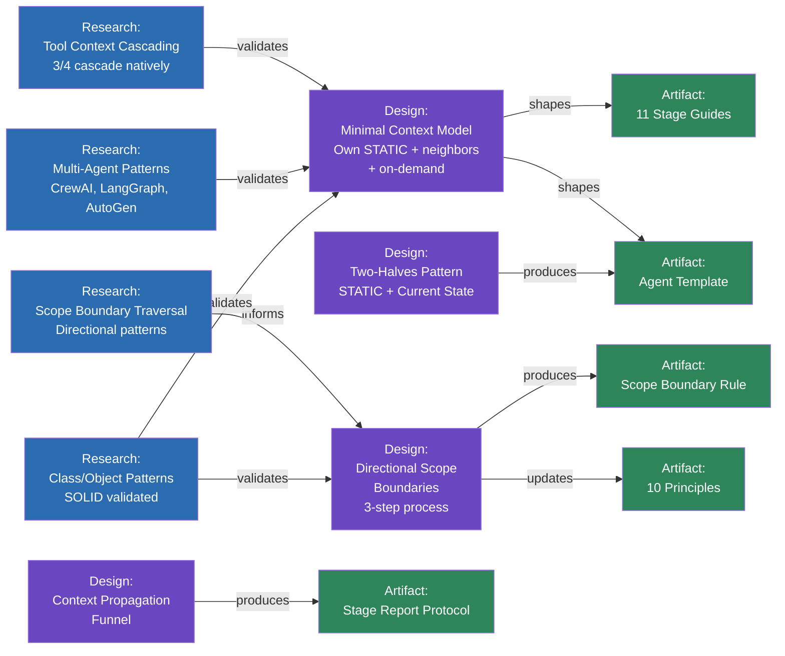
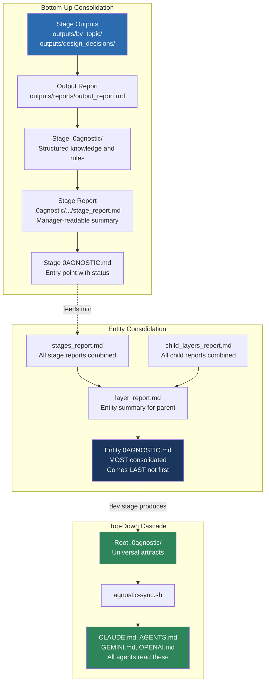
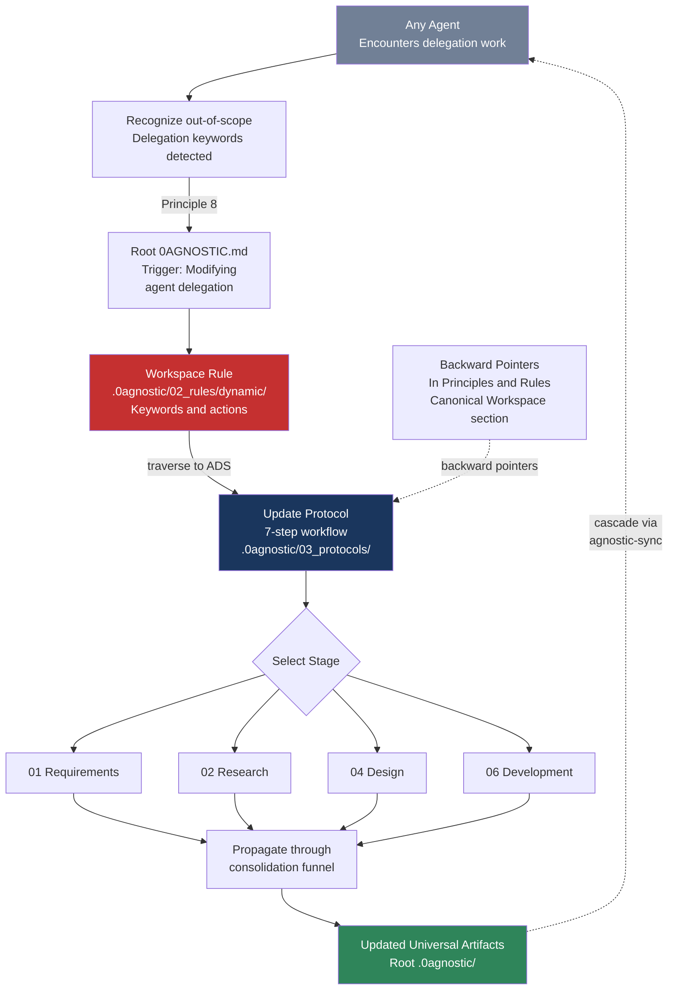
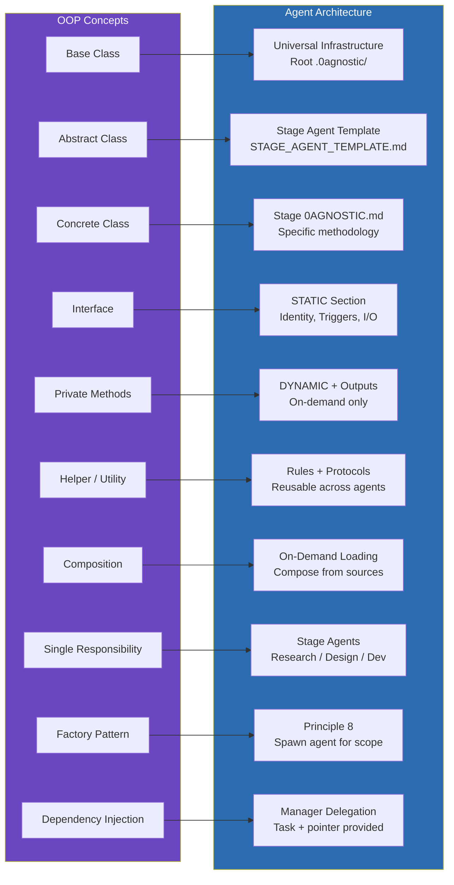
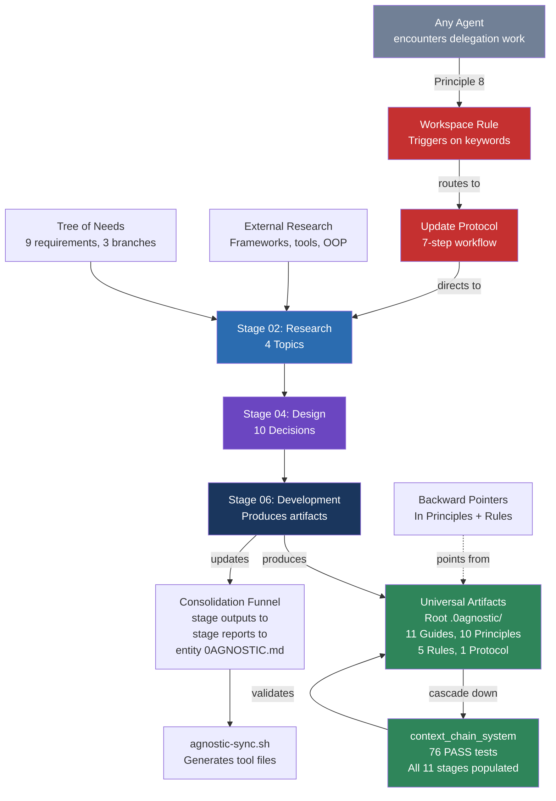
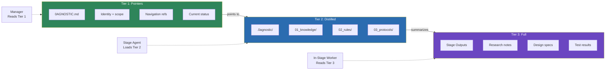
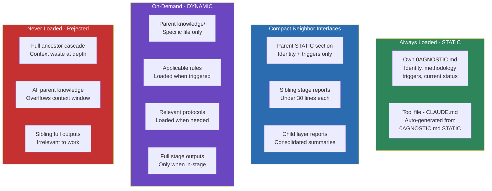

# Agent Delegation System — Architecture Diagrams

Comprehensive Mermaid.js diagrams showing how all components of the agent delegation system connect and fit within the greater layer-stage system.

---

<!-- section_id: "a5752550-415f-47e4-aa4e-a8f003f6f5e9" -->
## 1. Entity Hierarchy and Position in the Greater System

Where ADS sits in the layer-stage hierarchy, its children, and the universal artifacts it produces.

---

<!-- section_id: "41929b3c-4396-4a1e-bf25-1b4dea1a2e13" -->
## 2. Research-to-Production Pipeline

How research findings flow through design decisions into universal artifacts.

---

<!-- section_id: "71e0cba3-6028-4108-adf4-06aaf4e87f4d" -->
## 3. Consolidation Funnel

How information propagates from stage outputs up to the entity source of truth, and how universal artifacts cascade down to all agents.

---

<!-- section_id: "12bc77a8-9c8c-4931-bf0d-c0699c5b6fe8" -->
## 4. Canonical Workspace Pattern

How agents anywhere in the system recognize delegation work and traverse to ADS.

---

<!-- section_id: "f51e51ef-83ad-41f9-913d-38ea08f50a18" -->
## 5. OOP-to-Agent Architecture Mapping

How object-oriented programming concepts map to the agent delegation architecture.

---

<!-- section_id: "f09020b1-661d-4f4d-931d-b1b64be18b44" -->
## 6. Complete System Overview

The full picture: how research, design, artifacts, validation, and the canonical workspace loop all connect.

---

<!-- section_id: "27d78fbb-d245-4668-9490-564ed9a0575f" -->
## 7. Three-Tier Knowledge Model

How knowledge is structured at each tier, from pointers to full detail.

---

<!-- section_id: "39e6e334-90a4-422d-a563-203d64a9bac9" -->
## 8. Agent Context Model

What each agent loads: always, compact neighbors, on-demand, and never.

---

<!-- section_id: "f0752d68-527e-468b-9c0f-6f0fcf2e4ee2" -->
## Diagram Index

| # | Diagram | Shows |
|---|---------|-------|
| 1 | Entity Hierarchy | Where ADS sits, its children, and universal artifact production |
| 2 | Research-to-Production Pipeline | How 4 research topics flow to 10 design decisions flow to universal artifacts |
| 3 | Consolidation Funnel | Bottom-up propagation from stage outputs to entity source of truth |
| 4 | Canonical Workspace Pattern | How agents recognize delegation work and traverse to ADS |
| 5 | OOP-to-Agent Mapping | How class/object patterns map to agent architecture concepts |
| 6 | Complete System Overview | Full picture of all components and their connections |
| 7 | Three-Tier Knowledge | Pointer to Distilled to Full knowledge tiers |
| 8 | Agent Context Model | What each agent loads: always, compact, on-demand, never |
