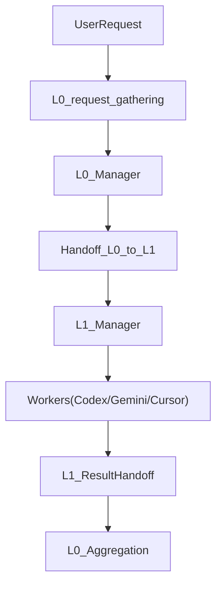

# Integrate Ideal AI Manager Hierarchy System Into 0_ai_context

## Overview

We will weave the "Ideal AI Manager Hierarchy System" spec into the existing `0_layer_universal` documentation and layer/stage structure so that it becomes the **canonical Agent OS** design for all AI work. The work is primarily documentation and directory-structure alignment: no behavioral code changes are required, but agents will be able to discover, navigate, and apply the ideal hierarchy directly from the repo.

## 1. Wire the Ideal Spec Into Top-Level Navigation

- **1.1 Master index and overview docs**
- Update [`code/0_layer_universal/0_context/MASTER_DOCUMENTATION_INDEX.md`](code/0_layer_universal/0_context/MASTER_DOCUMENTATION_INDEX.md) to:
    - Add an explicit section for the **AI Manager Hierarchy System** that links to:
    - [`.../overview/README.md`](code/0_layer_universal/0_context/-1_research/-1.01_things_researched/ai_manager_hierarchy_system/overview/README.md)
    - [`.../overview/IDEAL_AI_MANAGER_HIERARCHY_SYSTEM.md`](code/0_layer_universal/0_context/-1_research/-1.01_things_researched/ai_manager_hierarchy_system/overview/IDEAL_AI_MANAGER_HIERARCHY_SYSTEM.md)
    - [`.../things_learned/ideal_ai_manager_hierarchy_system/`](code/0_layer_universal/0_context/-1_research/-1.01_things_researched/ai_manager_hierarchy_system/things_learned/ideal_ai_manager_hierarchy_system)
    - Mark this as the **canonical architecture** for the Agent OS.
- Update [`SYSTEM_OVERVIEW.md`](code/0_layer_universal/0_context/SYSTEM_OVERVIEW.md) to:
    - Introduce the Agent OS concept (layers, stages, managers/workers, handoffs) using the short text from the overview files.
    - Point readers directly into the ideal hierarchy summary for deeper understanding.
- Update [`USAGE_GUIDE.md`](code/0_layer_universal/0_context/USAGE_GUIDE.md) to:
    - Add a short "How to work with the AI Manager Hierarchy" section (which docs to read first, which layers/stages to touch, what handoffs are).

## 2. Align the Layer/Stage Framework With the Ideal Architecture

- **2.1 Framework docs**
- Update [`layer_1/layer_2_features/layer_2_feature_layer_stage_system/layer_1/layer_2_02_sub_layers/README.md`](code/0_layer_universal/0_context/layer_1/layer_2_features/layer_2_feature_layer_stage_system/layer_1/layer_2_02_sub_layers/README.md) so that:
    - Its description of layers (L0–L3, optional L4+) matches `architecture.md` and `summary/IDEAL_AI_MANAGER_HIERARCHY_SYSTEM.md`.
    - Its stage list explicitly includes `stage_0_00_request_gathering` and matches the chronological pipeline defined in the ideal spec.
    - It references the ideal hierarchy docs as the **design rationale** for the framework templates.
- Where appropriate, add short references in the layer templates under `layer_1/layer_2_features/layer_2_feature_layer_stage_system/layer_1/layer_2_02_sub_layers` (L0–L3 templates) that:
    - Link to the relevant sections of `architecture.md`, `tools_and_context_systems.md`, and `os_and_quartets.md`.

## 3. Standardize Manager/Worker + Handoff Behavior Across Layers

- **3.1 Layer manager system READMEs**
- For each of `layer_0`, `layer_2_project`, `layer_2_features`, and `layer_4_components`:
    - Update or create `*/<N>.00_ai_manager_system/README.md` to:
    - Summarize the manager/worker roles at that layer, based on `architecture.md` and `summary/IDEAL_AI_MANAGER_HIERARCHY_SYSTEM.md`.
    - Describe how that layer consumes/produces handoffs (upstream/downstream and between stages).
    - Point to the ideal-spec docs (`architecture.md`, `tools_and_context_systems.md`, `parallel_execution.md`, `supervisor_patterns.md`) as deeper references.
- **3.2 Handoff schema definition**
- In a central, discoverable location (e.g. `layer_0_group/0.01_manager_handoff_documents/0.00_to_universal/handoff_schema.md`):
    - Define a **canonical handoff schema** in Markdown/JSON Schema form based on the summary spec (fields like `schemaVersion`, `kind`, `layer`, `stage`, `from`, `to`, `task`, `constraints`, `artifacts`, `subtasks`, `results`, `status`).
    - Include 1–2 minimal JSON examples for vertical (layer-to-layer) and horizontal (stage-to-stage) handoffs.
- Link this schema from each `*/<N>.01_manager_handoff_documents/README.md` so agents can always discover it.
- **3.3 Structured manager/worker workflows**
- In each layer’s `0.99_stages/*/ai_agent_system/README.md` (or equivalent stage docs):
    - Briefly document how that stage’s manager reads an `incoming` handoff, spawns workers (possibly parallel), and writes `outgoing` handoffs, with a pointer back to the ideal hierarchy docs for full detail.

### Diagram – Manager/Worker + Handoffs

## 4. Implement OS and Tool Variants (Quartets) in the Live Context

- **4.1 OS folders at key layer/stage locations**
- Using the patterns from [`os_and_quartets.md`](code/0_layer_universal/0_context/-1_research/-1.01_things_researched/ai_manager_hierarchy_system/things_learned/ideal_ai_manager_hierarchy_system/os_and_quartets.md), introduce `os/<os-id>/` trees in high-value locations first (then generalize):
    - `layer_0_group/0.99_stages/stage_0_01_instructions/ai_agent_system/os/`
    - `layer_2_project/1.99_stages/stage_1.01_instructions/ai_agent_system/os/`
    - And analogous locations for `L2` and `L3` where layer managers live.
- For each `os/<os-id>/` (e.g., `wsl`, `linux_ubuntu`, `windows`, `macos`):
    - Stub or copy in initial `CLAUDE.md`, `AGENTS.md`, `GEMINI.md` scaffolds.
    - Add comments pointing back to `os_and_quartets.md` as the normative spec.
- **4.2 Tool-specific context patterns**
- In `layer_0_group/0.02_sub_layers/sub_layer_0_12_universal_tools` and `sub_layer_0_10_mcp_servers_and_tools_setup`:
    - Ensure docs reference the quartet/N-tuple pattern for tool context (Claude, Codex, Gemini, Cursor, plus future tools).
    - Tie existing MCP OS/app layout under `sub_layer_0_10_mcp_servers_and_tools_setup/0.02_mcp_config_options_0_file_tree_0/0.03_operating_systems/` back to the ideal-spec OS-variant description.

## 5. Integrate Tool & Framework Orchestration Guidance

- **5.1 Framework orchestration**
- In an appropriate universal tools/protocols area (likely under `sub_layer_0_12_universal_tools` or `sub_layer_0_13_universal_protocols`):
    - Add a short index document that:
    - Summarizes how LangGraph, AutoGen, CrewAI, MetaGPT, etc. can be plugged into the hierarchy per [`framework_orchestration.md`](code/0_layer_universal/0_context/-1_research/-1.01_things_researched/ai_manager_hierarchy_system/things_learned/ideal_ai_manager_hierarchy_system/framework_orchestration.md).
    - Links to the detailed orchestration doc.
- **5.2 CLI recursion syntax and examples**
- In a dedicated file under universal tools/protocols (e.g., `sub_layer_0_12_universal_tools/.../cli_recursion_syntax.md`):
    - Lift the concrete CLI examples from [`cli_recursion_syntax.md`](code/0_layer_universal/0_context/-1_research/-1.01_things_researched/ai_manager_hierarchy_system/things_learned/ideal_ai_manager_hierarchy_system/cli_recursion_syntax.md).
    - Adapt them to your current terminal wrapper and environment (keeping `OS/Tool scope` explicit in the Applicability section, following the Protocol Writing Standard).

## 6. Add Operational, Safety, and Deployment Guidance

- **6.1 Observability & logging**
- Under a universal sub-layer (likely `universal_tools` or a dedicated observability protocol folder):
    - Create a short `observability.md` that:
    - Summarizes key logging/metrics/tracing expectations from [`observability_and_logging.md`](code/0_layer_universal/0_context/-1_research/-1.01_things_researched/ai_manager_hierarchy_system/things_learned/ideal_ai_manager_hierarchy_system/observability_and_logging.md).
    - Specifies where logs should live in the layer/stage/handoff structure.
- **6.2 Safety & governance**
- Under `sub_layer_0_04_universal_rules` or `sub_layer_0_13_universal_protocols`:
    - Add a safety/governance rule or protocol that:
    - Encodes key guardrails from [`safety_and_governance.md`](code/0_layer_universal/0_context/-1_research/-1.01_things_researched/ai_manager_hierarchy_system/things_learned/ideal_ai_manager_hierarchy_system/safety_and_governance.md).
    - Ties into existing git rules, approval gates, and budget limits.
- **6.3 Deployment**
- Create a short `deployment_overview.md` under a universal sub-layer (e.g., `ai_apps_tools_setup` or `universal_tools`):
    - Summarize main deployment patterns from [`production_deployment.md`](code/0_layer_universal/0_context/-1_research/-1.01_things_researched/ai_manager_hierarchy_system/things_learned/ideal_ai_manager_hierarchy_system/production_deployment.md).
    - Clarify how the Agent OS maps to deployed services and background workers.

## 7. Rollout and Migration Strategy

- **7.1 Phase 1 – Documentation alignment only**
- Implement Sections 1–3 fully, so navigation, manager/worker expectations, and handoff schema are consistent and discoverable.
- No behavioral changes; agents simply get better, unified context.
- **7.2 Phase 2 – OS/tool variants and orchestration**
- Implement Section 4 for Layer 0 and one pilot project (Layer 2) first.
- Implement the minimal orchestration guidance from Section 5.
- **7.3 Phase 3 – Operationalization**
- Add observability, safety, and deployment guidance (Section 6).